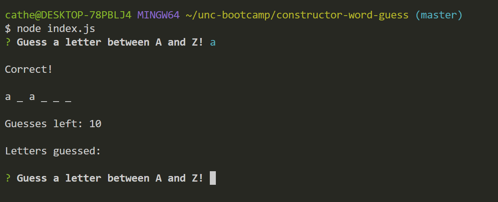
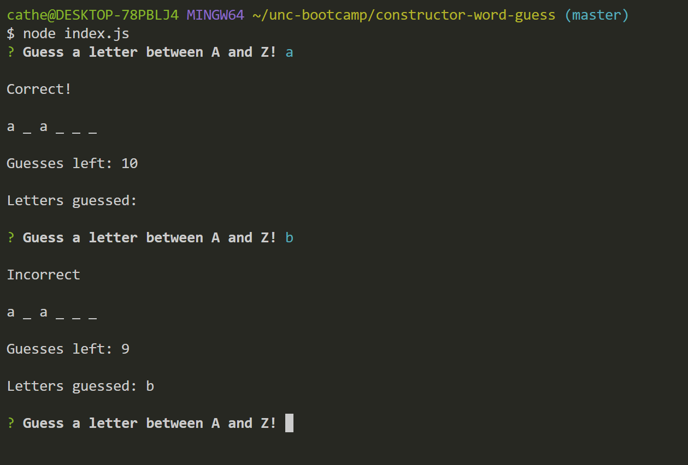
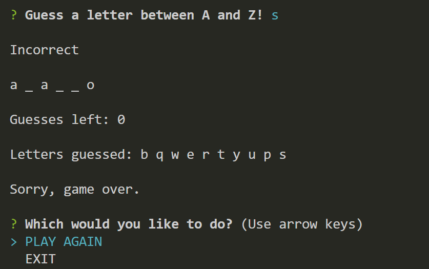
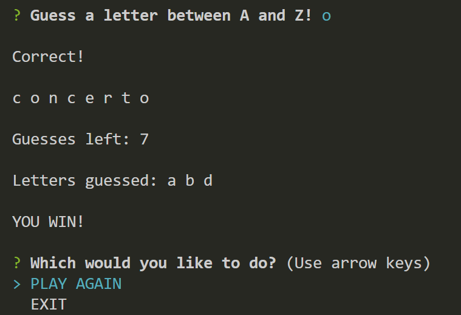
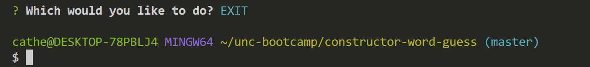

# Constructor-Word-Guess

Constructor word guess is a Node.js command line interface game. Try to guess the hidden word!. You are given 10 attempts, which will decrement with each incorrect guess. The game requires the `inquirer` NPM package.

## Letter.js 

This file contains a constructor that will display a blank space within the word if the user has not guessed the letter.

## Word.js

This file contains a constructor that is dependent on the Letter constructor. This constructor will create an object representing the word the user is attempting to guess.

## index.js

The file that contains the logic for the game, which requires the Word constructor. The game randomly selects a word and uses the Word constructor to store it. It then prompts the user to guess letters and keeps track of the letters that the user has and has not guessed.

### Screenshots

* The game loads, and the user is prompted to guess a letter:

* The letter which the user guesses is checked and deemed to be either correct or incorrect:

* If the user fails to guess the word and uses 10 incorrect letters, the game ends and the user is prompted again:

* If the user successfully guesses the word, the game ends and the user is prompted again:

* If the user selects 'Exit', the game ends and the user returns to the console.

